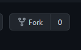
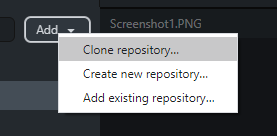

# New Republic Custom Events
### What is this?
MBII Allows creation of custom FA Maps, with custom characters, weapons, models.
These are NR clans custom maps with custom siege, character, teams and models.

## I am a player
#### How do i download these maps before i play?
- You due to play an event?
- You are getting a PK3 Missing or Mismatch error when you try and join?

Head over to https://github.com/New-Republic-Clan/MBII-Custom-Events/releases
Every map will have its latest `PK3` available here for download. These must be installed into your `C:\SteamLibrary\steamapps\common\Jedi Academy\GameData\MBII` folder or whenever your team Library is found

If the author has updated the map, you will **need** to redownload the PK3 before you can join


## I am an event organisers / creator

#### How do i contribute?
This repo contains the "master" copy the maps. 
and includes all current maps being used by the server at present. 

If you are planning on doing the following
- Creating a new event. 
- Make changes to an existing event

You will need to **fork** this repo, make your changes, when happy, use a "pull request" to push your changes to this repo. 

#### How do i do this?

You will need the following
- A Github Account https://github.com/join
- A copy of GitHub Desktop. https://desktop.github.com/

#### These are then the steps

##### Get Signed In

- Sign into github.com
- Sign into Github desktop using your new account

##### Fork this repo

Click the "Fork" button at the top right hand side of this repo
```

```
This will create a personal copy of this entire repo for you to edit at your will. 

##### Create a local copy

In GitHub Desktop goto Add / Clone Repository
```

```
Search the list for your new "Fork" and clone to your local computer
You should now have a local copy of ALL the event maps in 
`C:\Users\<USER>\Documents\GitHub\MBII-Custom-Events`

##### If Creating a new event
Create a new folder named for the your event in the root of the repo. 
There are some resources below to help with how to build a new event using an existing map

##### If changing an event

- Make your changes
- 
##### Test your event

- Test your changes locally (see below for more help)
- 
##### Commit back to your fork
- In Github Desktop you will see a list of your changes on the left. Click "Commit to master" and then once its enabled, click "Push Changes" in the top right. 

##### Pull Request
Once your fork has your new changes and you are ready to make a pull request. Pull requests are your way of "requesting" to push your change into the official clan repo. To do this goto the official repo and click the "Pull Request" tab. You should see your proposed changes. When ready, hit "Create pull Request"
Once you do this, any additional changes you commit will not be added unless you make another pull request

##### Admins will approve
A repo admin will approve your change and it will be added to the repo

### How do i use the maps here on our servers?
Everytime a change is pushed to THIS repo. the release PK3s are generated for every map, then, a few times a day, the maps from this repo are downloaded to our server and available for use. 

### How do i create and test an event locally?

Once you've forked this repo and cloned it locally, you can create a new folder for your event map name

Choosing the map your event is based around, open the PK3 in Winrar and extract copies of all the files inside, into your new event folder 

Now you follow this video on how to create .siege, .mbch and mbtc files for your event
[https://www.youtube.com/watch?v=7h5oJsiYRMY](https://www.youtube.com/watch?v=7h5oJsiYRMY "https://www.youtube.com/watch?v=7h5oJsiYRMY")

To test your progress, you will need to create an empty zip file, drop the contents of your map folder into it. rename this from a .zip to a .pk3 file. Drop this into your MBII directory and then start your own server in FA mode. 

### More Reading
[MBTC Team File](https://moviebattles.fandom.com/wiki/MBTC_Team_File)  
[MBCH Values](https://moviebattles.fandom.com/wiki/MBCH_Values)  
[.MBCH Guide](https://moviebattles.fandom.com/wiki/.MBCH_Guide)  
[Creating your first FA](https://moviebattles.fandom.com/wiki/Creating_your_first_FA)

### For your PR to be accepted

- Your map should be prefixed `nr_`
- Any characters you add which are new, should have a shared prefix, ie, event is seige of mandolore, all new characters are `som_stormtrooper_with_saber`
- Any teams which are new are prefixed as above for example `som_team_red`
- Events must be balanced. If we deem the balance means one team can not win fairly, it will be asked to be changed
- Any included models, graphics, sounds, images must be used, don't include assets that are not needed as they just waste file size
- Do NOT include any compiled PK3s, only the folder, this repo will compile for you automatically and deploy
- Ensure your maps are tested, if they do not load without debugging they will be declined. 
- Ensure changes are ready and deployed atleast 24 hours before the event. Do not expect to be asking for Pull Requests 15 minutes before the event

